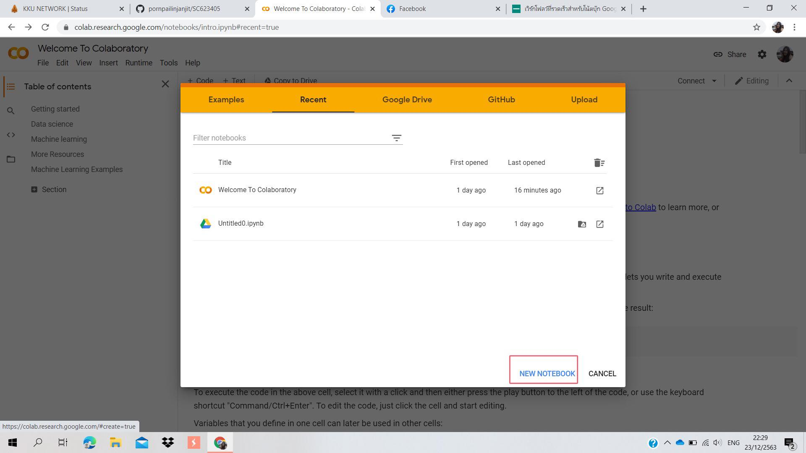

# data_viz
พรไพลิน จันทร์จิตร 613020193-8
ตัวอย่างการแทรกรูป
insert image

การบ้านครั้งที่1
ขั้นตอนการบันทึกจาก google colab ลงใน github
ขั้นที่ 1.สร้างที่เก็บใน github 
สร้างที่เก็บ คลิกปุ่ม "NEW"

เพิ่มชื่อในช่อง Repository name
คลิก เลือก Add a README file
คลิกปุ่ม Create repository

หน้าจอถัดไปจะเป็นที่เก็บกระดานชนวนเปล่าซึ่งแสดงไฟล์ README ของคุณ

 ขั้นที่ 2.สร้างหรือเปิดสมุดบันทึก Colab ใน Google Drive
 คลิกปุ่ม "NEW NOTEBOOK" เพื่อสร้างสมุดบันทึก

 ขั้นที่ 3.Saveสมุดบันทึกลงใน Github
 ไปที่เมนู File คลิก "save a copy in Github"

ป๊อปอัปจะปรากฏขึ้น เลือกReposityory ของคุณที่ต้องการบันทึกลง 
คลิกปุ่ม OK

จากนั้นแท็บใหม่จะเปิดขึ้นสำหรับสมุดบันทึกของคุณคอมมิตบน Github

 
